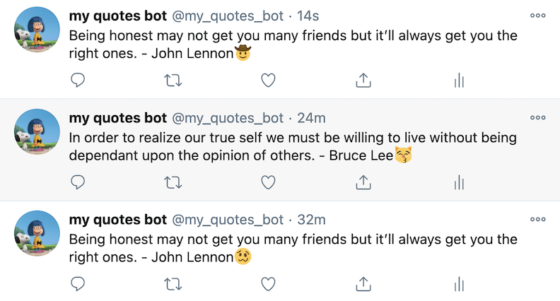

# Twitter Quotes Bot

## About the Project
This project is for building my own Twitter bot that publishes different famous quotes with a random emoji on Twitter feed every hour. It's built with a [Twitter gem](https://github.com/sferik/twitter). This application can be run on your local PC, and also you can deploy it with [Heroku](https://www.heroku.com/).

A list of commonly used resources that I find helpful is listed in the acknowledgments.

## Table of Contents

* [About the Project](#about-the-project)
  * [Built With](#built-with)
* [Sample Bot](#sample-bot)
* [Getting Started](#getting-started)
* [How to use](#how-to-use)
* [Author](#author)
* [Contributing](#contributing)
* [Show your support](#show-your-support)
* [License](#license)
* [Acknowledgements](#acknowledgements)

### Built With

* [Ruby](https://www.ruby-lang.org/en/)

## Sample Bot

[Twitter bot sample](https://twitter.com/my_quotes_bot)

## Getting Started

To get a local copy up and running follow these simple example steps.

1. On the project GitHub page, navigate to the main page of the repository.
2. Under the repository name, locate and click on a green button named `Code`. 
3. Copy the project URL as displayed.
4. If you're running the Windows Operating System, open your command prompt. On Linux, Open your terminal. 
5. Change the current working directory to the location where you want the cloned directory to be made. Leave as it is if the current location is where you want the project to be. 
6. Type git clone, and then paste the URL you copied in Step 3.  
e.g. $ git clone https://github.com/yourUsername/yourProjectName 
7. Press Enter. Your local copy will be created. 

## How to use

### Create Twitter App and Get token & keys

1. Go to [Twitter account for developers](https://developer.twitter.com/en), and Login or Signup
2. Scroll down and click "Get started"
3. Click "Apply for a developer account", then move to [Developer Portal](https://developer.twitter.com/en/portal/projects-and-apps)
4. In the "Standalone Apps" section, click "Create App"
5. Answer some required questions so that you can create your first Twitter App
6. Once you create it, go back to [Developer Portal](https://developer.twitter.com/en/portal/projects-and-apps) and click the setting icon next to the App name that you just created
7. In the "Settings" section, change the "App permissions" into "Read and Write"
8. Click the "keys and tokens" tab on top of the page, then copy and save API key & secret(consumer key and secret) and Access token & secret

### How to run the bot from your local PC

1. Create your Twitter App following the above section
2. On your computer, open the terminal and go to the project folder  eg: `cd Desktop/my-twitter-bot`
3. On your terminal, enter `bundle install`
4. Go to bin/main.rb and replace ENV['...'] into your real Keys and tokens that you just saved in the step 8 on [above direction](#create-twitter-app-and-get-token--keys)
5. Enter `ruby ./bin/main.rb` to run the code
6. Go to your Twitter feed and check if the tweet is correctly tweeted

### How to deploy your bot with Heroku

1. On your local computer, go to the folder you just cloned or downloaded, and enter `git init` in your Terminal or Comand Prompt
2. Create a Github repo for your project and register it as your remote repository 
eg: `git remote add YOUR_REPOSITORY_PATH`
3. Login or create an account for [Heroku](https://www.heroku.com/)
4. Go to the [personal dashboard](https://dashboard.heroku.com/apps) and click "New > Create new app"
5. Enter the App name and create it
6. Go to "Config Vars" in the "Settings" tab, and add your Twitter App's keys and tokens that you just saved in the step 8 on [above direction](#create-twitter-app-and-get-token--keys)
7. On your bin/main.rb file, replace the client config from real keys and tokens to like 'ENV['KEYS TITLE']'
8. Now, commit your files and push it to your Github repository 
eg: `git add -A`, `git commit -m "some comments"`, `git push origin branch_name`
9. Go to "Deployment method" in the "Deploy" tab, and connect your Github repo of your project
10. Click deploy and check your Twitter account to make sure if it publishes your bot tweet correctly

### How to change the time interval

1. Go to the line `sleep` inside a loop in bin/main.rb
2. Now, it's set 3600 that means it's done every 1 hour, you can change the number whatever you like to set the interval
3. It's based on the second, so if you want to post your tweet every 1 min, you can change the number to 60 eg: `sleep 60`

## Author

👤 **Yoko Saka**

- GitHub: [@yocosaka](https://github.com/yocosaka)
- Twitter: [@yocosaka](https://twitter.com/yocosaka)
- LinkedIn: [Yoko Saka](https://www.linkedin.com/in/yokosaka)

## Contributing

Contributions, issues, and feature requests are welcome!
Feel free to check the [issues page](../../issues).

1. Fork the Project
2. Create your Feature Branch (`git checkout -b feature/AmazingFeature`)
3. Commit your Changes (`git commit -m 'Add some AmazingFeature'`)
4. Push to the Branch (`git push origin feature/AmazingFeature`)
5. Open a Pull Request

## Show your support

Give a ⭐️ if you like this project!

## License

This project is [MIT](./LICENSE) licensed.

## Acknowledgements
* [Twitter gem](https://github.com/sferik/twitter)
* [Emojipedia](https://emojipedia.org/emoji/)
* [Heroku](https://www.heroku.com/)
